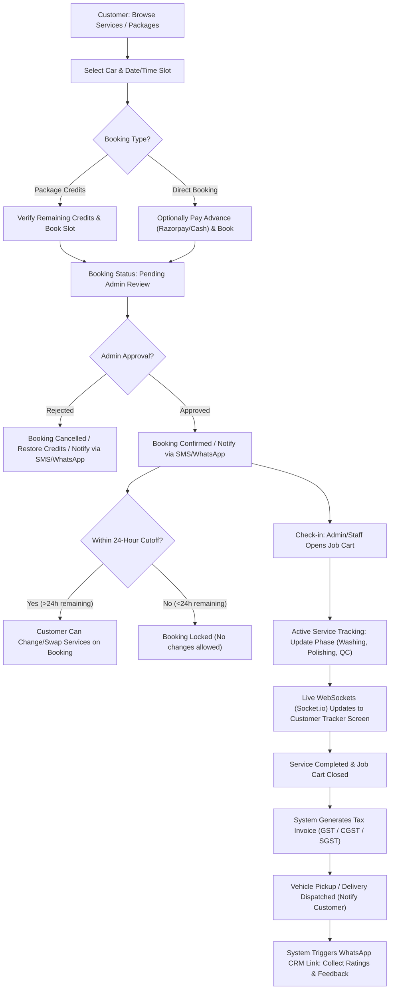
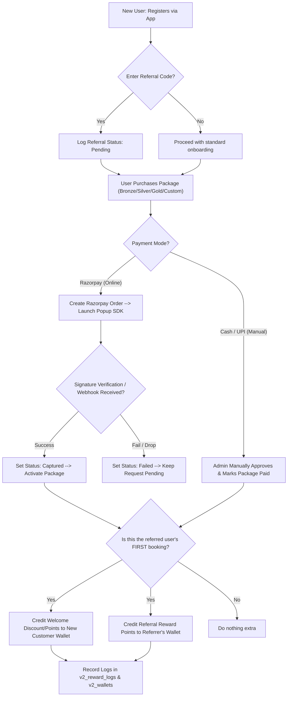
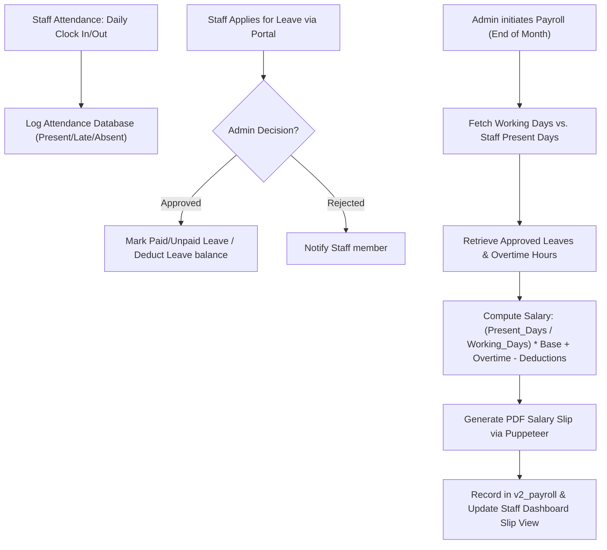

# GK AutoHerb - System Architecture, Dashboards, Flows, & Features Document

Welcome to the comprehensive system documentation for **GK AutoHerb**, a state-of-the-art Car Studio Management Platform. This document outlines the role-based dashboard architectures, detailed system feature implementations, step-by-step workflow flowcharts, and the underlying tech stack.

---

## 1. Dashboard Architectures (Role-Based)

The system is designed with a strict Role-Based Access Control (RBAC) model. It divides features into three primary dashboard spaces:

### 1.1 Customer Portal (`/customer`)
An intuitive, responsive interface for vehicle owners to manage profiles, vehicles, active packages, bookings, and live service tracking.
*   **Dashboard Home (`CustomerDashboardPage`)**: 
    *   Visual status cards showing active packages, days remaining (real-time countdown), remaining service credits (washes, wax, etc.), and accumulated loyalty rewards/points.
    *   Quick links for Booking a Service, Buying Packages, and Vehicle Management.
*   **Vehicle Management (`VehiclesPage`)**: 
    *   Allows adding/editing vehicles with Brand, Model, Reg Number, and Registration Year (via dynamic dropdown 1990–Current).
*   **Booking Engine (`BookingPage`)**: 
    *   Step-by-step flow: Select Vehicle → Check package credit availability vs. cash booking → Select Slot (with real-time availability indicator) → Select Services (with dynamic duration badges) → Pay Advance (if required by settings) → Confirm.
*   **Booking History & Changes (`BookingsPage`)**: 
    *   Tracks pending, confirmed, completed, and cancelled bookings.
    *   Provides a **Change Service** button (active up to 24 hours prior to slot time) enabling customers to modify/swap services.
*   **Live Service Tracking (`TrackingPage`)**: 
    *   Real-time status updates powered by WebSockets (Socket.io) showing the progress of their car: `Check-in` → `Inspection` → `Washing` → `Polishing` → `Quality Check` → `Ready for Delivery`.
*   **Loyalty & Rewards (`LoyaltyPage`)**: 
    *   Displays referral code, wallet balance, and transactional logs of points earned/redeemed. Button to share code/referral link via WhatsApp.

---

### 1.2 Admin Dashboard (`/admin`)
An extensive control hub for administrators to oversee workshop operations, slot schedules, inventory, payroll, invoicing, and accounts.
*   **Overview & Analytics (`DashboardPage`)**: 
    *   Displays today's booked slots vs. capacity (utilization progress bars), active staff count, pending package approvals, low-stock inventory alerts, and revenue counters.
*   **Job Cart Operations (`JobCartListPage`, `JobCartCreatePage`, `JobCartDetailPage`)**: 
    *   Master tool for vehicle servicing: opens new job carts, documents initial condition (fuel, scratch maps), allocates parts/labor, updates tracking stage, calculates totals, and completes jobs.
*   **Customer & Vehicles Directory (`CustomersListPage`, `CustomerDetailPage`)**: 
    *   360-degree profile of each customer displaying details, associated vehicles, past packages, invoice history, and package credit adjustments.
*   **Slot & Capacity Management (`SlotsPage`)**: 
    *   Manage calendar slots, block dates (e.g., maintenance/holidays), configure capacity, and book offline walk-ins.
*   **Package Management & Approvals (`PackagesPage`, `PackageApprovalsPage`, `PackagesTrackingPage`)**: 
    *   Catalog setup for standard packages (Bronze, Silver, Gold, etc.).
    *   Approval queue for package requests (Razorpay online or Manual Cash verification).
    *   **Custom Package Module**: Ability to create bespoke, hidden packages for VIP customers, specifying custom service quantities and validity.
*   **Accounts & Balance Sheets (`AccountsPage`, `BalanceSheetPage`, `PaymentsPage`, `AllInvoicesPage`)**: 
    *   Sales invoices (GST tax compliance), purchase invoices, GSTR reports, and real-time Profit & Loss balance sheet calculations.
*   **Quick Wash Queue (`QuickWashPage`)**: 
    *   Fast-track dashboard for express washing. Tracks sub-phases (`Pre-wash` → `Foam Wash` → `Rinse` → `Vacuum` → `Dry & Polish`).
*   **Staff, Salaries, & HR (`StaffPage`, `StaffHRPage`, `StaffSalaryPage`, `StaffDetailPage`)**: 
    *   Technician task assignment, daily attendance logs (clock in/out), leave approvals, role selection, and monthly salary processing based on working days and overtime.

---

### 1.3 Staff Portal (`/staff`)
A mobile-friendly, streamlined panel restricted to technicians and washers to view tasks and update active service details without financial visibility.
*   **Today's Task Queue (`StaffJobCartsPage`)**: 
    *   Lists only the job carts scheduled for the current day. Financial values (service/parts prices) are hidden.
*   **New Entry Creation**: 
    *   Create job carts for today's walk-ins or add Quick Wash queue entries.
*   **Quick Wash Stepper**: 
    *   Staff can advance express washes through phases (`Pre-wash` → `Foam` → `Rinse` → `Vacuum` → `Dry` → `Complete`).
*   **Benefits & Salary Advances (`StaffBenefitsPage`)**: 
    *   Enables staff to check their processed payroll slips, incentives, and leave balances.
*   **Check In / Check Out**: 
    *   Clock attendance at the start/end of the shift.

---

## 2. System Flow Diagrams

The following Mermaid diagrams illustrate the key workflows of the platform.

### 2.1 Vehicle Booking to Service & Delivery Workflow
This workflow demonstrates how a service booking request moves from a customer request to confirmation, job cart tracking, invoicing, and final feedback collection.

---

### 2.2 Payment, Package Purchase, & Referral Rewards Flow
This flowchart maps out Razorpay integration, online package activation, the customer referral system, and wallet credit distributions.

---

### 2.3 Staff Management, Leaves, & Payroll Processing Flow
This flowchart details how attendance logs, leave records, and manual parameters compile into the monthly payroll slip.

---

## 3. Features & Modules Matrix (All 31 Updates)

Below is the structured breakdown of the 31 client-specific feature updates implemented in the platform:

| Update ID | Feature Category | Module Name | Core Logic & Technical Notes |
| :--- | :--- | :--- | :--- |
| **01** | Revenue / Payment | **Razorpay Gateway** | Active checkout popup. Handles payment verification via HMAC-SHA256 signatures and handles delayed captures via Razorpay Webhook. |
| **02** | Revenue / Payment | **Package Renewal** | Within 30 days of package expiry, allows online/offline renewals. Resets washes, wax, and service entitlements back to catalog defaults. |
| **03** | Operations | **Service Change 24h Window** | Customers can swap services on confirmed bookings up to 24 hours before the slot. Logs differences to audit logs and locks booking afterwards. |
| **04** | Operations | **Advance Payment** | Settings-controlled fixed or percentage deposit requirement during service bookings. Deducts advance from final job invoice. |
| **05** | Onboarding | **Vehicle Year Dropdown** | Replaces vehicle registration year text inputs with a dynamic 1990-current select dropdown, storing `manufacture_year` in DB. |
| **06** | UX/UI | **UI/UX Polish** | Implements service price matrices based on car categories (Hatchback/Sedan/SUV), countdown alerts, skeleton loaders, and table row animations. |
| **07** | Staff / Security | **Restricted Staff Dashboard** | Restricts staff views to current day's job cards. Automatically hides prices/billing data from the UI when a user has a `staff` role. |
| **08** | Operations | **Wash Sequence Progress** | Stepper display for Quick Wash queue (`Pre-wash` to `Dry`). Emits WebSocket events on phase shifts to instantly update customer tracker UI. |
| **09** | Marketing | **Referral Program** | Generates unique 6-character referral codes. Applies welcome points to new users and credits referrers on the new user's first confirmed booking. |
| **10** | Finance | **Balance Sheet** | Combines revenues (job cards, packages, manual bills) and expenses (salary, purchases, operating) to output dynamic P&L charts & PDF/XLSX exports. |
| **11** | Operations | **Booking Availability Toggle** | Enables admin to pause new bookings globally. Automatically disables the "Book Now" button on the customer portal if slots are full or paused. |
| **12** | Integrations | **WhatsApp Business API** | Connects template notifications via official Meta Cloud API or MSG91 gateways, utilizing SMS only as a fallback option. |
| **13** | Marketing | **Auto Lifecycle Notifications** | Cron-triggered warnings sent 7 days and 1 day before package expiration, alongside automated status updates (confirmed, started, ready). |
| **14** | Security | **Extended RBAC** | Custom role creation (e.g. Reception, Manager) with granular permissions mapping (e.g., `bookings:read`, `job_carts:write`). |
| **15** | Operations | **Pickup & Delivery Options** | Integrates request toggle during customer booking. Details driver assignments and stores coordinates in the database. |
| **16** | Operations | **Admin Manual Booking** | Allows administrators to book a specific slot directly for walk-in or offline clients, auto-populating client profile info. |
| **17** | Finance | **Car Info in Manual Billing** | Admin can optionally record vehicle specifications (Reg No, Brand, Model) directly on a manual invoice without creating a permanent vehicle record. |
| **18** | Operations | **Custom Packages** | Admin tool to create bespoke packages (services list, specific counts, price, validity) and assign them directly to a customer profile. |
| **19** | Finance | **Data History Exports** | Generates detailed Excel workbooks (.xlsx) outlining comprehensive customer package usage histories, logs, and renewals. |
| **20** | Operations | **Offline Slot Blocking** | Gives administrators the ability to completely block specific calendar slots for studio maintenance or training, marking it unavailable to users. |
| **21** | Operations | **Live Tracking Timeline** | Step-by-step progress tracking widget for customers, linking to `v2_tracking_history` database entries. |
| **22** | Collaboration | **Public File Sharing** | Generates cryptographically secure, time-expiring links for invoices and before/after job photos, viewable without logging in. |
| **23** | UX/UI | **Service Durations** | Displays estimated service time (e.g., `1h 45m`) on service cards and aggregates booking time totals on checkout. |
| **24** | Marketing | **New Customer Welcome** | Checks history upon booking confirmation. If it is the user's first booking, applies admin-configured welcome rewards (points/discounts). |
| **25** | Integrations | **Lifecycle Messengers** | Wires event hooks across booking confirmations, job-card initiations, and delivery stages to trigger dual-channel notifications. |
| **26** | UX/UI | **Admin Customer Package View** | Interactive breakdown in Customer Detail view showing total vs. remaining counts per service, usage logs, and credit modification tools. |
| **27** | Operations | **Multi-Vehicle Packages** | Links `user_packages` directly to `vehicle_id`. Customers with multiple vehicles can hold distinct active packages per car. |
| **28** | Inventory | **Resale Inventory Gallery** | Enhances inventory with Accessories vs. Consumables categorization. Supports 5 Cloudinary images per product, barcodes, and SKU levels. |
| **29** | Finance | **Accounts & GST Reports** | Generates GSTR-1 & GSTR-2 reports. Tracks purchases, vendor payments, sales returns, and outputs GST-compliant tax invoices. |
| **30** | HR / Payroll | **Staff HR Suite** | Integrates task trackers, payroll calculation engines, leave forms, and salary slip generators in the admin panel. |
| **31** | CRM | **Feedback Collection** | Auto-sends unique, single-use review tokens upon service completion. Form collects star ratings and reviews, with admin reply controls. |

---

## 4. Technical Stack Details

*   **Frontend**: 
    *   *Core Library*: React v18.3.1 + TypeScript + Vite
    *   *Styling*: Tailwind CSS v3.4.7 + PostCSS v8.4.40 + Autoprefixer v10.4.19
    *   *State & Caching*: Zustand v4.5.4 (with sessionStorage persistence) + TanStack React Query v5.51.21
    *   *API Client*: Axios v1.7.3 (with custom interceptors for JWT injection and 401 redirection)
    *   *Forms & Validation*: React Hook Form v7.52.2 + Zod v3.23.8
    *   *Real-time updates*: Socket.io-client v4.7.5
    *   *Charts & Visuals*: Recharts v3.8.1, Lucide React v0.414.0 (Icons), Framer Motion v12.40.0 (Transitions)
    *   *Excel & Dates*: xlsx v0.18.5, date-fns v3.6.0, react-datepicker v7.3.0
*   **Backend**: 
    *   *Runtime*: Node.js
    *   *Framework*: Express.js v4.19.2
    *   *Database Driver*: mysql2 v3.10.3 (utilizing promise pool connections)
    *   *Auth & Security*: JWT (jsonwebtoken v9.0.2 with 7-day tokens), bcryptjs v2.4.3 (Hashing), helmet v7.1.0, cors v2.8.5
    *   *File Uploads*: multer v1.4.5-lts.1 + cloudinary v2.4.0 + multer-storage-cloudinary v4.0.0
    *   *Real-time server*: socket.io v4.7.5
    *   *Document compilation*: Puppeteer v22.14.0 (HTML-to-PDF), exceljs v4.4.0 (Excel workbook generation)
    *   *Cron jobs*: node-cron v3.0.3

---

## 5. Database Schema & Data Models

The MySQL database schema is structured into Core Tables (active operational data) and Phase 2/3 Extended Tables (wallet, rewards, payment transactions, and advanced RBAC).

### 5.1 Core Database Tables

#### 1. `users`
Stores credentials, contacts, and base system roles.
*   `id` (INT UNSIGNED, PK, AUTO_INCREMENT)
*   `name` (VARCHAR(100))
*   `mobile` (VARCHAR(15), UNIQUE) — Primary identifier/login
*   `email` (VARCHAR(150), UNIQUE)
*   `password_hash` (VARCHAR(255))
*   `role` (ENUM('admin', 'customer', 'staff'), DEFAULT 'customer')
*   `referral_code` (VARCHAR(20), UNIQUE) — Alphanumeric referral code

#### 2. `vehicles`
Stores customer vehicle profiles.
*   `id` (INT UNSIGNED, PK, AUTO_INCREMENT)
*   `registration_no` (VARCHAR(20))
*   `customer_id` (INT UNSIGNED, FK -> `users.id`)
*   `brand` (VARCHAR(80))
*   `model` (VARCHAR(80))
*   `manufacture_year` (SMALLINT UNSIGNED) — Year of registration/manufacture
*   `is_primary` (TINYINT(1), DEFAULT 1)

#### 3. `slots`
Manages daily workshop booking slots.
*   `id` (INT UNSIGNED, PK, AUTO_INCREMENT)
*   `slot_date` (DATE)
*   `start_time` (TIME)
*   `end_time` (TIME)
*   `max_capacity` (INT UNSIGNED, DEFAULT 1)
*   `booked_count` (INT UNSIGNED, DEFAULT 0)
*   `is_blocked` (TINYINT(1), DEFAULT 0) — Set by admin to override slot availability

#### 4. `bookings`
Tracks customer booking requests, slots, status, and package credit reservation intent.
*   `id` (INT UNSIGNED, PK, AUTO_INCREMENT)
*   `customer_id` (INT UNSIGNED, FK -> `users.id`)
*   `vehicle_id` (INT UNSIGNED, FK -> `vehicles.id`)
*   `slot_id` (INT UNSIGNED, FK -> `slots.id`)
*   `package_id` (INT UNSIGNED, FK -> `packages.id`) — Mapped if package-based booking
*   `total_duration` (INT UNSIGNED) — Sum of service times in minutes
*   `status` (ENUM('pending_approval', 'confirmed', 'cancelled', 'completed', 'expired', 'rejected'))
*   `advance_amount` (DECIMAL(10,2), DEFAULT 0.00)
*   `advance_payment_id` (INT) — Links to advance payment transaction
*   `current_phase` (VARCHAR(30), DEFAULT 'pre_wash') — For live wash step tracking
*   `job_type` (ENUM('standard', 'quick_wash'), DEFAULT 'standard')

#### 5. `booking_services`
Many-to-many relationship mapping multiple services to a booking.
*   `id` (INT UNSIGNED, PK, AUTO_INCREMENT)
*   `booking_id` (INT UNSIGNED, FK -> `bookings.id` ON DELETE CASCADE)
*   `service_id` (INT UNSIGNED, FK -> `services.id`)

#### 6. `job_carts`
Represents active repair orders in the workshop detailing bay.
*   `id` (INT UNSIGNED, PK, AUTO_INCREMENT)
*   `vehicle_id` (INT UNSIGNED, FK -> `vehicles.id`)
*   `booking_id` (INT UNSIGNED, FK -> `bookings.id`)
*   `visit_date` (DATE)
*   `status` (ENUM('draft', 'open', 'complete', 'cancelled'), DEFAULT 'draft')
*   `discount_type` (ENUM('percentage', 'fixed'))
*   `discount_value` (DECIMAL(10,2))
*   `advance_amount` (DECIMAL(10,2), DEFAULT 0.00)
*   `balance_due` (DECIMAL(10,2), DEFAULT 0.00)
*   `invoice_number` (VARCHAR(50)) — Generated on service completion

#### 7. `job_services` & `job_products` & `job_photos`
*   `job_services`: Logs service items, prices, and labor charges details on a job cart.
*   `job_products`: Tracks inventory items or materials consumed during a specific job.
*   `job_photos`: Stores Cloudinary image URLs mapping before-and-after vehicle conditions.

#### 8. `services` & `packages`
*   `services`: Contains service configurations, durations, and pricing matrix per vehicle category.
*   `packages`: Catalog definition of packages, wash/wax counts, pricing tier, and whether it is custom.

#### 9. `user_packages` & `package_usage`
*   `user_packages`: Active customer package subscriptions (`start_date`, `end_date`, `vehicle_id`, `package_status`).
*   `package_usage`: Usage ledger tracking available vs consumed credits mapped to booking/job IDs.

---

### 5.2 Extended Phase 2/3 Tables

#### 1. `v2_wallets` & `v2_wallet_transactions` & `v2_reward_logs`
*   `v2_wallets`: Customer wallet holding virtual balance, reward points, and total calculations.
*   `v2_wallet_transactions`: Ledger of wallet balance movements (credits/debits).
*   `v2_reward_logs`: Tracks points logs (welcome bonus, referral bonus, or adjustments).

#### 2. `v2_payments` & `v2_payment_transactions` & `v2_refunds`
*   `v2_payments`: Log of checkout sessions (`payment_method`, `status`, `razorpay_order_id`, `razorpay_payment_id`, `razorpay_signature`).
*   `v2_payment_transactions`: Attempts and JSON gateway responses per checkout.
*   `v2_refunds`: Initiated refunds (`razorpay_refund_id`, `status`, `amount`).

#### 3. `v2_referrals`
Tracks customer referrals.
*   `id` (INT, PK, AUTO_INCREMENT)
*   `referrer_id` (INT UNSIGNED, FK -> `users.id`)
*   `referred_id` (INT UNSIGNED, FK -> `users.id`)
*   `referral_code` (VARCHAR(20))
*   `status` (ENUM('pending', 'completed', 'rewarded'))

#### 4. `v2_package_renewals` & `v2_package_usage_logs`
*   `v2_package_renewals`: Log of package extension events, payment reference, and date.
*   `v2_package_usage_logs`: Historic package credit usage for analytical audit sheets.

#### 5. `v2_whatsapp_templates` & `v2_notification_logs`
*   `v2_whatsapp_templates`: Messaging templates and placeholder variable mapping JSON.
*   `v2_notification_logs`: Tracks sent messages, channels (SMS/WhatsApp), status, and retry counts.

#### 6. `v2_roles` & `v2_permissions` & `v2_role_permissions`
*   `v2_roles`: Setup of custom workspace roles (e.g. Technician, Receptionist).
*   `v2_permissions`: Master list of permission policies (e.g. `bookings:write`).
*   `v2_role_permissions`: Join table mapping permissions to roles.

#### 7. `v2_blocked_slots`
*   `id` (INT, PK, AUTO_INCREMENT)
*   `slot_id` (INT, FK -> `slots.id`)
*   `blocked_date` (DATE)
*   `reason` (VARCHAR(255)) — e.g. "Equipment Maintenance", "Walk-in reserved"

#### 8. `v2_tracking_history`
*   `id` (INT, PK, AUTO_INCREMENT)
*   `job_cart_id` (INT, FK -> `job_carts.id`)
*   `stage` (ENUM('checked_in', 'inspection', 'washing', 'polishing', 'quality_check', 'ready', 'delivered'))
*   `changed_by` (INT, FK -> `users.id`)
*   `notes` (TEXT)
*   `created_at` (TIMESTAMP)

